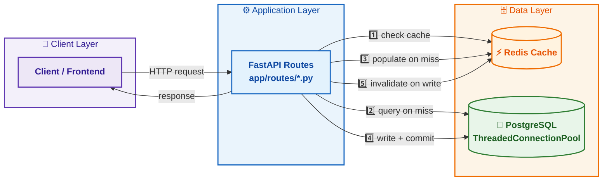
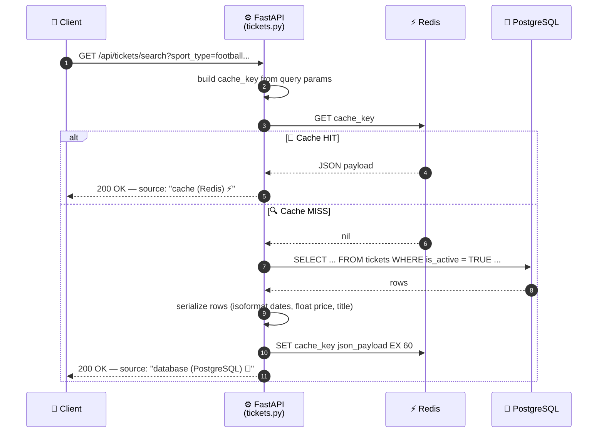
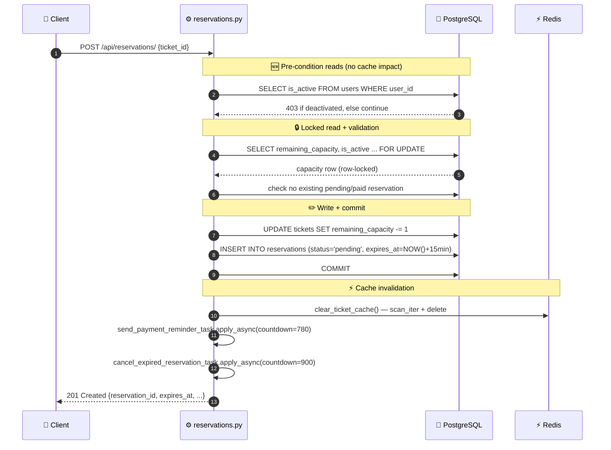
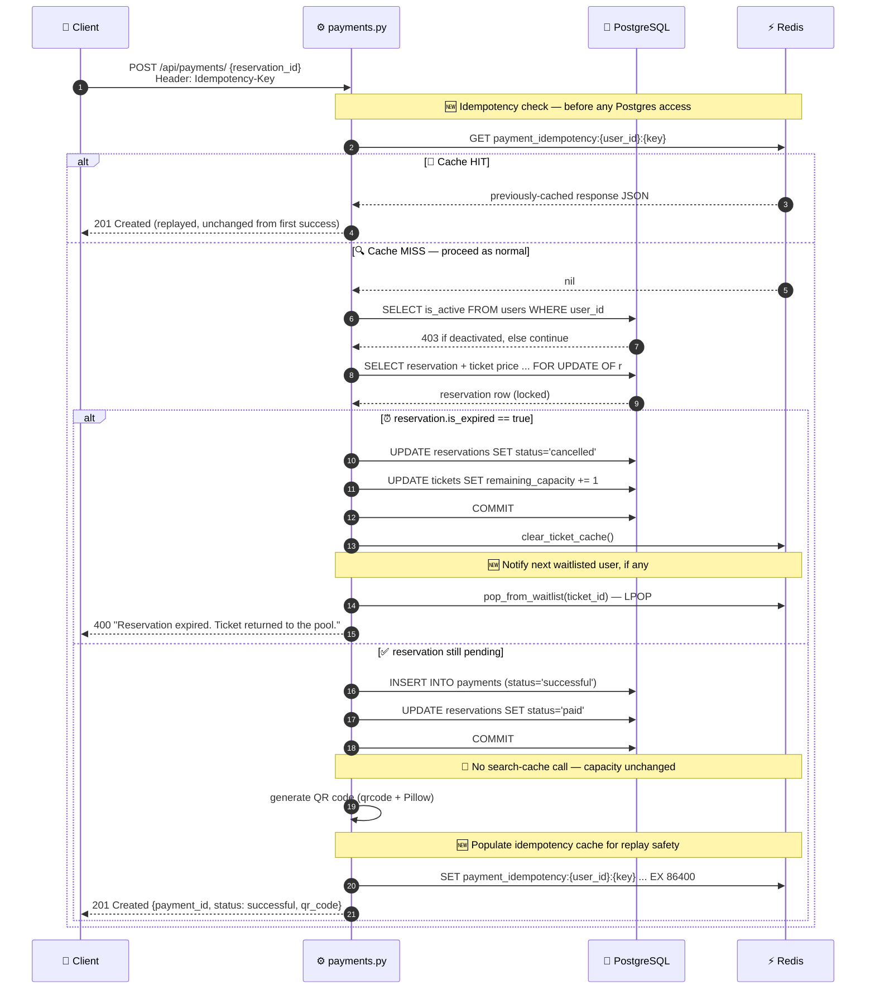
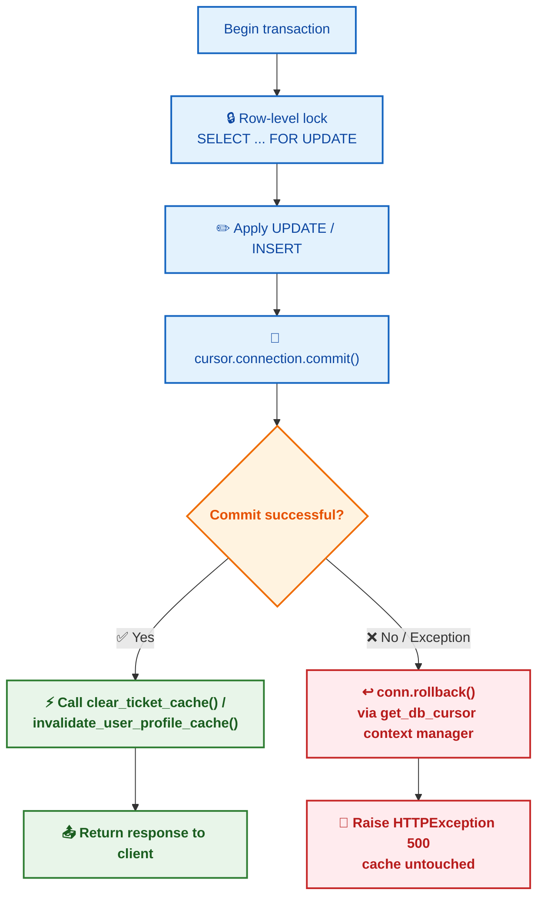
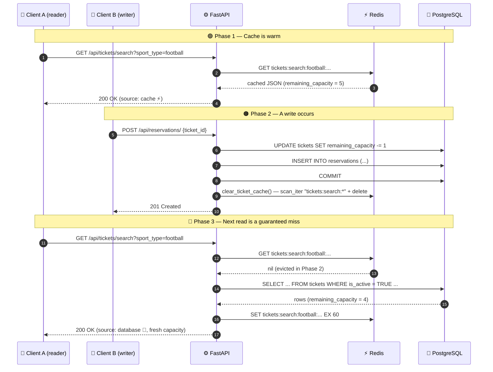
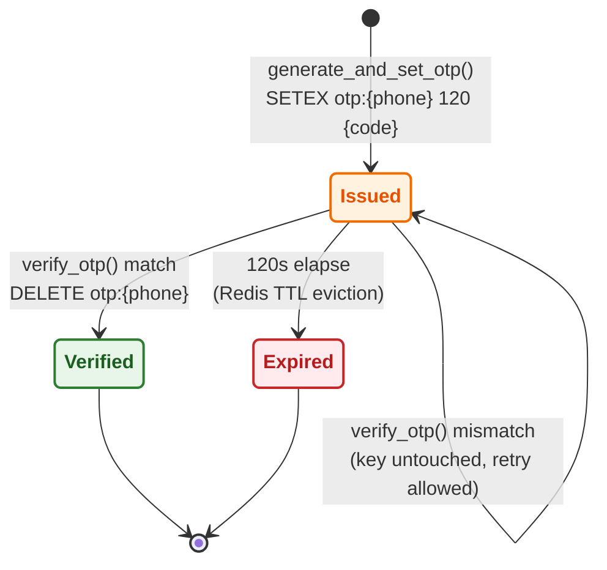
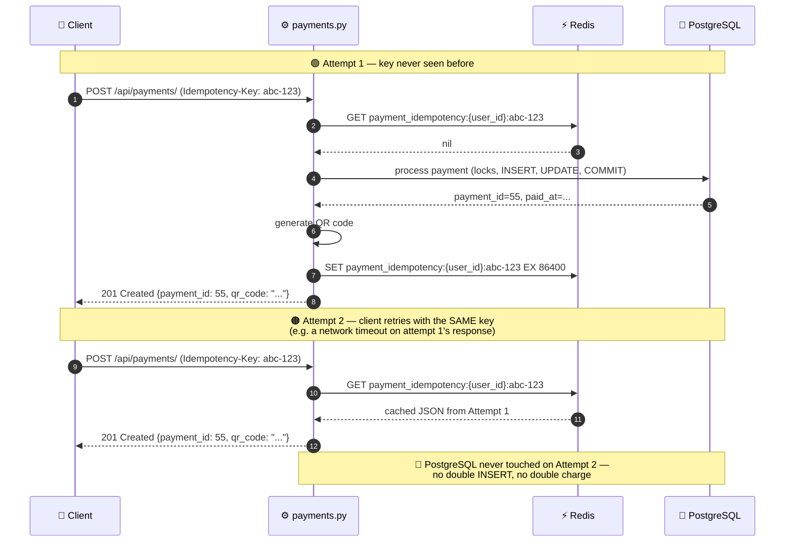

# Database Synchronization & Cache Invalidation Strategy

**SportsTicketPlatform — Phase 3 Technical Documentation**

   -lightgrey)

> This document describes how SportsTicketPlatform keeps its Redis cache layer consistent with the PostgreSQL source of truth. It is written directly against the current implementation (`app/config.py`, `app/database.py`, `app/redis_client.py`, and the route modules under `app/routes/`) and is intended to be appended to the project's phase documentation set.

---

## Table of Contents

1. [System Architecture Overview](#1-system-architecture-overview)
2. [Centralized Configuration](#2-centralized-configuration)
3. [Cache-Aside Pattern — Ticket Search](#3-cache-aside-pattern--ticket-search)
4. [Core Cache Invalidation Primitives](#4-core-cache-invalidation-primitives)
5. [Invalidation Triggers Across the Application Layer](#5-invalidation-triggers-across-the-application-layer)
6. [Transaction Safety: Commit-Then-Invalidate](#6-transaction-safety-commit-then-invalidate)
7. [Data Flow Diagrams](#7-data-flow-diagrams)
8. [Cache Key Reference Table](#8-cache-key-reference-table)
9. [Known Limitations & Future Work](#9-known-limitations--future-work)
10. [File Reference Index](#10-file-reference-index)

---

## 1. System Architecture Overview

SportsTicketPlatform does not use an ORM. Every database interaction is a raw SQL statement executed through `psycopg2`, and every read-heavy endpoint sits in front of a **Redis cache-aside layer**. Three components cooperate on every request:

| Layer | Technology | Responsibility |
|---|---|---|
| **API** | FastAPI | Request validation (Pydantic schemas), routing, auth (JWT via `OAuth2PasswordBearer`), orchestration |
| **System of Record** | PostgreSQL, accessed via raw SQL (`psycopg2.pool.ThreadedConnectionPool`) | Durable, transactional storage of tickets, reservations, payments, and users |
| **Speed Layer** | Redis (`redis-py`, `decode_responses=True`) | Ephemeral cache for expensive search queries, OTP codes, and user profile reads — plus, as of this revision, an idempotency cache for payment responses and a persistent waitlist queue for sold-out tickets (§4.4, §4.5) |



The defining architectural rule of this system is:

> **PostgreSQL is always the source of truth. Redis is a disposable performance optimization.** If Redis were flushed entirely at any moment, the platform would continue to function correctly — just slower, until the cache warms back up. No business logic ever trusts Redis for a decision it cannot re-derive from PostgreSQL.

This is precisely why the invalidation strategy can be "coarse but correct" (e.g., wiping an entire search-cache namespace rather than surgically patching individual cached rows) — correctness matters more than cache-hit efficiency during write bursts.

> ⚠️ **Amendment, this revision:** the "Redis is disposable" invariant above holds for the search cache, the OTP store, the profile-cache placeholder, and the payment-idempotency cache (losing any of these degrades performance or, at worst, allows a retried request to be reprocessed — it never produces an *incorrect* result, since PostgreSQL's own `reservations.status` check still blocks a double-payment even without the idempotency cache; see §4.4). **The one genuine exception is the sold-out-ticket waitlist (§4.5): it has no backing PostgreSQL table at all.** If Redis were flushed, every ticket's waitlist — and every user's position in it — would be silently and permanently lost, with nothing in PostgreSQL to reconstruct it from. This is a deliberate scope trade-off for the current phase, not an oversight, but it is the one place in this system where the stated architectural rule doesn't fully apply. See §9.

---

## 2. Centralized Configuration

All environment-dependent values — database credentials, Redis connection parameters, JWT settings, and TTL thresholds — are declared in a single Pydantic settings object: `app/config.py`.

```python
class Settings(BaseSettings):
    ...
    # Redis Settings
    REDIS_HOST: str = "localhost"
    REDIS_PORT: int = 6379
    REDIS_DB: int = 0

    # Security Settings (Tokens and OTP)
    JWT_SECRET_KEY: str
    JWT_ALGORITHM: str = "HS256"
    ACCESS_TOKEN_EXPIRE_MINUTES: int = 120
    OTP_EXPIRE_SECONDS: int = 120

    model_config = SettingsConfigDict(
        env_file=".env", env_file_encoding="utf-8", extra="ignore"
    )
```

### Why this matters for cache consistency

| Setting | Default | Role in the invalidation strategy |
|---|---|---|
| `REDIS_HOST` / `REDIS_PORT` / `REDIS_DB` | `localhost` / `6379` / `0` | Resolved once at import time in `app/redis_client.py` to build the single shared `redis_client` instance used by every route module. There is exactly one Redis client for the whole process — no per-request client creation, no connection drift between the search cache, the OTP store, and the profile cache. |
| `OTP_EXPIRE_SECONDS` | `120` | Defines the **TTL contract** for one-time passwords. It is passed to `redis_client.setex()` inside `generate_and_set_otp()`, meaning Redis itself — not application code — enforces expiry. This guarantees an OTP can never be validated after its window closes, even if the verifying process crashes or is delayed. |
| `JWT_SECRET_KEY` / `ACCESS_TOKEN_EXPIRE_MINUTES` | — / `120` | Not part of the cache layer directly, but every write endpoint that triggers invalidation (`reserve_ticket`, `process_payment`, `cancel_ticket`, `update_profile`) is gated behind `get_current_user_id`, which decodes this JWT. Invalidation is therefore always scoped to an **authenticated** mutation. |

Centralizing these values means the TTL for search results (`ex=60`, hardcoded in `tickets.py`) and the TTL for OTPs (`OTP_EXPIRE_SECONDS`, configurable via `.env`) can evolve independently without touching connection logic — `Settings` is the single knob for environment-specific behavior, while cache *policy* (what gets cached, for how long) lives next to the query that produces the data.

> 💡 **Design note:** The 60-second search TTL is currently a literal in `tickets.py` rather than a `Settings` field. **The same is true of the newer 24-hour payment-idempotency TTL** (`ex=86400`, hardcoded in `payments.py` — see §4.4). Promoting either to a `Settings` field (e.g., `TICKET_SEARCH_CACHE_TTL: int = 60`, `PAYMENT_IDEMPOTENCY_TTL_SECONDS: int = 86400`) would let them be tuned per-environment (e.g., a shorter search TTL in staging for faster iteration, or a shorter idempotency window for load testing) without a code change — see [§9 Known Limitations](#9-known-limitations--future-work). The waitlist queue (§4.5) has no TTL at all, so this doesn't apply to it.

---

## 3. Cache-Aside Pattern — Ticket Search

The read path for `GET /api/tickets/search` in `app/routes/tickets.py` is the canonical cache-aside implementation in this codebase.

### 3.1 Cache key construction

The key is built deterministically from every query parameter, with explicit fallback tokens (`'all'`, `'0'`, `'inf'`) so that two logically-identical requests always hash to the same string:

```python
cache_key = (
    f"tickets:search:{sport_type or 'all'}:{venue or 'all'}:"
    f"{min_price or '0'}:{max_price or 'inf'}:"
    f"{team_name or 'all'}:{ticket_tier or 'all'}:"
    f"{start_date or 'all'}"
)
```

This produces keys such as:

```
tickets:search:football:all:0:inf:all:VIP:all
tickets:search:basketball:Azadi Stadium:50000:200000:all:all:2026-09-01
```

Every generated key is prefixed with the fixed namespace `tickets:search:`. This prefix is the single most important convention in the whole strategy — it is what allows **bulk, pattern-based invalidation** later (§4.1) without tracking every individual key that was ever created.

> 💡 **What's actually inside the cached JSON, this revision:** the payload cached under each key is `{"source", "count", "tickets", "suggestions"}` — the fuzzy-search `suggestions` array (populated only on a zero-result exact search) rides along in the *same* key, with the *same* 60-second TTL and the *same* invalidation trigger as the primary `tickets` list. There is no separate cache entry or separate invalidation path for suggestions. Each `TicketResponse` object inside both arrays also now carries a `price` and `is_surge_pricing` flag that have already had dynamic surge pricing applied (`+15%` when a ticket's `remaining_capacity` is low) **before** being written into Redis — a cache hit returns the already-surged numbers as-is, it does not recompute them. This is safe without any additional invalidation logic: since surge pricing is a pure function of `remaining_capacity`, and `remaining_capacity` only ever changes through a write path that already calls `clear_ticket_cache()` (§5), the cached surge-adjusted price can never drift out of sync with the cached capacity it's derived from — the existing capacity-triggered eviction already covers it for free.

### 3.2 Request flow



### 3.3 Why a 60-second TTL

Ticket search results change whenever `remaining_capacity` changes (a reservation or cancellation) or whenever an admin activates/deactivates a listing. Rather than trying to invalidate every possible combination of filters that could touch an affected row, the design leans on two complementary mechanisms:

1. **Time-based decay** — `ex=60` guarantees that even in the worst case (an invalidation event is somehow missed), no stale search result survives longer than one minute.
2. **Event-based eviction** — `clear_ticket_cache()` (§4.1) proactively wipes the *entire* search namespace the instant capacity changes, so in the common case staleness is measured in milliseconds, not seconds.

This is a deliberate **belt-and-suspenders** approach: TTL is the safety net, explicit invalidation is the fast path.

---

## 4. Core Cache Invalidation Primitives

All invalidation logic is centralized in `app/redis_client.py`, alongside the single shared `redis_client` instance. Route modules never call `redis_client.delete()` or `redis_client.scan_iter()` directly — they call one of the named functions below. This keeps the *policy* of "what a mutation invalidates" in one file, decoupled from the many places that trigger it.

### 4.1 Non-blocking bulk eviction — `clear_ticket_cache()`

```python
def clear_ticket_cache():
    """Delete cached ticket search queries from Redis.
    This ensures stale search results are not served from cache.
    """
    try:
        for key in redis_client.scan_iter("tickets:search:*"):
            redis_client.delete(key)
    except Exception as e:
        print(f"Redis cache clearing error: {e}")
```

**Why `SCAN` instead of `KEYS`:** `KEYS "tickets:search:*"` is O(N) over the *entire* keyspace and blocks the single-threaded Redis event loop until it finishes — under load, that stall is visible to every other client talking to Redis at that instant. `scan_iter()` wraps Redis's cursor-based `SCAN` command, which walks the keyspace incrementally in small batches. It trades a slightly higher total round-trip cost for **never blocking the server**, which is the correct trade-off for a cache that many concurrent requests depend on.

Because every ticket-search cache entry lives under the fixed `tickets:search:` prefix, this single function correctly invalidates *every* filter combination ever cached — the caller doesn't need to know which specific `sport_type`/`venue`/`price` combinations were affected by a given write.

> ⚠️ **Trade-off:** this is a coarse, namespace-wide flush, not a surgical per-row invalidation. A capacity change on one football match evicts cached search results for volleyball and basketball too. Given the short 60-second TTL and the relatively low write frequency of reservations compared to reads, this is an acceptable cost for the simplicity and correctness it buys — see [§9](#9-known-limitations--future-work).

### 4.2 Targeted eviction — `invalidate_user_profile_cache(user_id)`

```python
def invalidate_user_profile_cache(user_id: int):
    """Clearing the user profile cache when editing information"""
    redis_key = f"user:profile:{user_id}"
    redis_client.delete(redis_key)
```

Unlike the search cache, a user's profile cache key is **fully deterministic and single-valued** — there is exactly one cache entry per user (`user:profile:{user_id}`), so invalidation is a direct `DELETE` on one key rather than a namespace scan. This is the appropriate strategy whenever a cache key can be derived directly from a primary key already known at write time.

### 4.3 Self-deleting, time-boxed secrets — OTP lifecycle

```python
def generate_and_set_otp(phone_number: str) -> str:
    otp_code = str(random.randint(100000, 999999))
    redis_key = f"otp:{phone_number}"
    redis_client.setex(redis_key, 120, otp_code)
    return otp_code


def verify_otp(phone_number: str, user_otp: str) -> bool:
    redis_key = f"otp:{phone_number}"
    stored_otp = redis_client.get(redis_key)
    if stored_otp and stored_otp == user_otp:
        redis_client.delete(redis_key)  # prevent reuse
        return True
    return False
```

The OTP flow is the one place in the codebase where Redis is not a *cache* of PostgreSQL data at all — it is the **primary, authoritative store** for a short-lived secret that never touches PostgreSQL. Two independent expiry mechanisms are stacked:

- **Passive expiry:** `setex(redis_key, 120, otp_code)` — Redis itself deletes the key after 120 seconds (mirroring `OTP_EXPIRE_SECONDS` from `config.py`), so an unused code disappears on its own.
- **Active invalidation-on-use:** on a *successful* verification, `verify_otp()` immediately calls `redis_client.delete(redis_key)`. This closes the single-use window deterministically — a correct code cannot be replayed twice, even within the same 120-second TTL.

If verification fails (wrong code), the key is deliberately **left in place** so the user can retry with the correct code until either they succeed or the 120-second TTL lapses naturally.

> 🆕 **This revision:** a third flow, `POST /api/auth/reset-password`, now also consumes `verify_otp()` — a forgotten-password reset re-uses the exact same self-deleting, time-boxed OTP primitive already used by signup, rather than introducing a separate secret-storage mechanism. No changes to `generate_and_set_otp()` / `verify_otp()` themselves were needed to support this; it's simply a second caller of an existing primitive.

### 4.4 Idempotent response caching — payment idempotency key

**New in this revision.** `POST /api/payments/` now requires an `Idempotency-Key` header on every call, and uses Redis to guarantee that retrying the exact same key never processes a payment twice:

```python
idempotency_cache_key = f"payment_idempotency:{user_id}:{idempotency_key}"
cached_response = redis_client.get(idempotency_cache_key)

if cached_response:
    return json.loads(cached_response)   # short-circuit — no DB access at all

# ... process the payment against PostgreSQL as normal ...

redis_client.set(idempotency_cache_key, json.dumps(response_dict), ex=86400)
```

This is a different *shape* of cache-consistency problem from the search cache: instead of asking "is this cached value still fresh relative to PostgreSQL?", it asks "have I already durably performed this exact write, identified by this exact client-supplied key?" A few properties worth calling out:

- **The check happens before any PostgreSQL access** — a cache hit here returns the previous response without even acquiring the `FOR UPDATE` row lock on the reservation. This is the one place in the codebase where a Redis read can fully bypass PostgreSQL for a *write* endpoint, not just a read endpoint.
- **The key is scoped by `user_id` *and* the client-supplied key** — the same idempotency key reused by two different users' tokens is cached separately and cannot collide or leak one user's cached payment to another.
- **Only the successful path populates this cache.** `redis_client.set(...)` is called once, at the very end of `process_payment()`, right before returning a `201`. If the same request instead falls into the "already paid" (`400`), "cancelled" (`400`), "expired" (`400`), or "account deactivated" (`403`) branches, **nothing is written to Redis** — those `HTTPException`s propagate straight out. A retry with the same `Idempotency-Key` after a failed/expired attempt therefore re-runs the full check-and-write logic from scratch rather than replaying a cached failure. This is a deliberate, reasonable asymmetry (there's nothing useful to "replay" from a failure), but it does mean the idempotency guarantee here is specifically "*a repeated successful payment is never double-processed*," not "*a repeated request with this key always returns the same thing.*"
- **TTL, not active invalidation.** Unlike `clear_ticket_cache()` or `invalidate_user_profile_cache()`, nothing ever explicitly deletes a `payment_idempotency:*` key — it simply expires after 24 hours (`ex=86400`), the same passive-expiry mechanism the OTP store uses, just with a much longer window appropriate to "how long might a client plausibly retry a payment request" rather than "how long is a one-time code valid."
- **Losing this cache is safe, not just inconvenient.** If Redis were flushed, a retried request with a previously-successful `Idempotency-Key` would simply re-run `process_payment()`'s normal logic — which would find the reservation already in `status = 'paid'` and correctly reject the retry with `400 Reservation is already paid`, rather than double-charging. PostgreSQL's own state is still what actually prevents a duplicate payment; the idempotency cache only saves the *client* from getting a slightly less friendly error and losing the original `qr_code`/`payment_id` on retry. This is consistent with the "PostgreSQL is always the source of truth" rule in §1.

### 4.5 Persistent, unbounded queue — sold-out ticket waitlist

**New in this revision.** `app/redis_client.py` adds two functions backing a per-ticket waitlist, used by the new `POST /api/reservations/waitlist` endpoint and consumed from `payments.py`:

```python
def add_to_waitlist(ticket_id: int, user_id: int) -> int:
    queue_key = f"waitlist:{ticket_id}"
    existing_users = redis_client.lrange(queue_key, 0, -1)
    if str(user_id) in existing_users:
        return -1                       # already queued
    redis_client.rpush(queue_key, user_id)
    return redis_client.llen(queue_key) # position at time of joining


def pop_from_waitlist(ticket_id: int):
    queue_key = f"waitlist:{ticket_id}"
    user_id = redis_client.lpop(queue_key)
    return int(user_id) if user_id else None
```

This is structurally the odd one out among everything else in this document:

- **It is not a cache of anything in PostgreSQL.** There is no `waitlist` table. `waitlist:{ticket_id}` *is* the data, not a cached copy of it — the same authoritative-store role that `otp:{phone_number}` plays (§4.3), but **without** that store's TTL-based self-cleanup. A waitlist entry lives forever until it's explicitly `LPOP`'d.
- **No TTL, by design** — a person shouldn't silently fall off a waitlist just because they've been queued for a while, the way an unused OTP should. But this also means an abandoned waitlist (for a ticket whose match already happened, say) has no automatic cleanup mechanism; nothing in the reviewed code ever calls `DEL waitlist:{ticket_id}` or lets it expire.
- **Consumption is a plain `RPUSH`/`LPOP` FIFO, not a cache-invalidation event.** `pop_from_waitlist()` is called from `payments.py` (both the lazy-expiry branch of `process_payment()` and `cancel_ticket()`, right after `clear_ticket_cache()` — see §5) whenever a seat frees up. It removes the oldest queued `user_id` and logs a mock notification; it does **not** touch the ticket-search cache, and joining/leaving the waitlist never triggers `clear_ticket_cache()` either, since `remaining_capacity` isn't affected by who's waiting for a ticket.
- **The position returned by `add_to_waitlist()` is a snapshot, not a live value.** It's simply `LLEN` immediately after the `RPUSH` — correct at the instant of joining, but the API has no endpoint to re-check a live position later, and the position isn't decremented as people ahead in the queue are popped.
- **No PostgreSQL fallback exists if this is lost** — see the amendment in §1 and the discussion in §9.

---

## 5. Invalidation Triggers Across the Application Layer

Every write path that changes data backing a cached read calls exactly one of the two eviction primitives from §4, and always **after** the PostgreSQL transaction has committed. The table below maps every mutation in the codebase to its cache effect.

| Route | File | DB Mutation | Cache Call | Notes |
|---|---|---|---|---|
| `POST /api/reservations/` | `reservations.py` → `reserve_ticket()` | `UPDATE tickets SET remaining_capacity = remaining_capacity - 1`, `INSERT INTO reservations (...status='pending'...)` | `clear_ticket_cache()` | Capacity changed → every cached search result showing this ticket's `remaining_capacity` (and any surge-adjusted `price` derived from it — see §3.1) is now stale. Now preceded by read-only `is_active` checks on both `users` and `tickets`, which don't mutate anything and don't change this row's cache behavior. |
| `POST /api/reservations/waitlist` 🆕 | `reservations.py` → `join_waitlist()` | *(none — no PostgreSQL write at all)* | `add_to_waitlist()` — `RPUSH waitlist:{ticket_id}` (§4.5) | Not a cache-invalidation call at all — it's a population write to a Redis-only queue. `remaining_capacity` is untouched (the endpoint only accepts tickets that are already sold out), so `clear_ticket_cache()` is correctly **not** called here. |
| `POST /api/payments/` (idempotency cache **hit**) 🆕 | `payments.py` → `process_payment()` | *(none — short-circuits before any PostgreSQL access)* | `GET payment_idempotency:{user_id}:{key}` (§4.4) | The most extreme case of "no DB mutation, no ticket-cache call": the entire rest of this table's logic for `POST /api/payments/` is skipped, and the previously-cached response is replayed verbatim. |
| `POST /api/payments/` (expired branch) | `payments.py` → `process_payment()` | `UPDATE reservations SET status='cancelled'`, `UPDATE tickets SET remaining_capacity = remaining_capacity + 1` | `clear_ticket_cache()`, then `pop_from_waitlist(ticket_id)` 🆕 | An expired reservation is auto-cancelled and its seat is returned to the pool — capacity changes again, so the cache must be evicted a second time. **New this revision:** immediately after, the freed ticket's waitlist (§4.5) is popped and a mock notification is logged — a Redis read/write with no corresponding PostgreSQL mutation and no effect on the ticket-search cache. |
| `POST /api/payments/` (successful branch) | `payments.py` → `process_payment()` | `INSERT INTO payments (...)`, `UPDATE reservations SET status='paid'` | `SET payment_idempotency:{user_id}:{key} ... EX 86400` 🆕 (§4.4) | **Still by design, no `clear_ticket_cache()` call:** capacity was already decremented at reservation time; a successful payment changes reservation/payment status only, which is not part of any cached ticket-search payload. The idempotency `SET` added this revision is a **different kind of cache call** — a population write for deduplication, not a search-cache invalidation — so it doesn't contradict the "no invalidation needed" reasoning below, it's simply an additional, orthogonal Redis interaction on this same code path. |
| `POST /api/payments/cancel` | `payments.py` → `cancel_ticket()` | `UPDATE reservations SET status='cancelled'`, `UPDATE tickets SET remaining_capacity = remaining_capacity + 1` | `clear_ticket_cache()`, then `pop_from_waitlist(ticket_id)` 🆕 | Cancellation returns a seat to the pool — capacity changed, cache evicted, and (new this revision) the waitlist is popped the same way as the expired-payment branch above. |
| `PUT /api/user/profile` | `users.py` → `update_profile()` | `UPDATE users SET first_name=..., last_name=..., city=...` | `invalidate_user_profile_cache(user_id)` | Scoped only to the mutated user; never touches the ticket-search namespace. |
| `GET /api/payments/cancellation-penalty/{id}` | `payments.py` → `calculate_cancellation_penalty()` | *(read-only)* | *(none)* | Pure calculation over live PostgreSQL data — nothing cached, nothing to invalidate. |

> 📌 **Key architectural insight:** invalidation is triggered by *capacity changes*, not by *any* write to the `reservations` or `payments` tables. The successful-payment path is the clearest example — it mutates two Postgres tables but calls zero *search-cache* invalidation functions, because neither mutation is reflected in any cached ticket-search payload (it does now make a Redis *write* of its own, but for idempotency deduplication, not cache consistency — see the row above). This is the correct mental model to apply when adding new endpoints in future phases: **ask "does this write change a value that is embedded in a cached response?" — not "did I just run an UPDATE?" (or, this revision's corollary: "did I just make a Redis call?").** The surge-pricing feature (§3.1) is a good stress-test of this mental model: it adds a new *derived* field to every cached ticket, but requires **zero** new invalidation code, precisely because it's a pure function of the one value (`remaining_capacity`) this table was already built around.

### 5.1 Reservation flow in detail



The `SELECT ... FOR UPDATE` row lock on `tickets` is what prevents two concurrent reservation requests from both reading the same `remaining_capacity` and both succeeding when only one seat remains — it serializes access to that row at the database level, independent of the cache. The cache invalidation only happens *after* this transaction commits, discussed further in §6.

### 5.2 Payment / expiry / cancellation flow in detail



---

## 6. Transaction Safety: Commit-Then-Invalidate

The connection lifecycle is centralized in `app/database.py`:

```python
@contextmanager
def get_db_cursor():
    conn = db_pool.getconn()
    try:
        cursor = conn.cursor(cursor_factory=RealDictCursor)
        yield cursor
        conn.commit()
    except Exception as e:
        conn.rollback()
        raise e
    finally:
        cursor.close()
        db_pool.putconn(conn)
```

Every route in this codebase additionally issues an **explicit, early `cursor.connection.commit()`** inside the `with get_db_cursor() as cursor:` block, immediately before calling a cache invalidation function — for example, in `reserve_ticket()`:

```python
cursor.connection.commit()
clear_ticket_cache()
background_tasks.add_task(expiration_reminder_task, ...)
```

### Why the explicit early commit matters

`get_db_cursor()`'s context manager *would* eventually commit on its own once the `with` block exits normally. But the invalidation call is placed **inside** the block, right after the explicit commit — not after the block exits. This ordering is deliberate and eliminates a specific race:

> If `clear_ticket_cache()` ran *before* the PostgreSQL commit was guaranteed durable, a concurrent request could re-populate the search cache with the transaction's pre-update values (since, from PostgreSQL's perspective, the change wouldn't be visible yet to another connection). The result would be a **freshly-repopulated but stale cache entry** that then has to wait out the full 60-second TTL before self-correcting.

By forcing the sequence to be **commit → invalidate**, any request that re-reads and repopulates the cache immediately after invalidation is guaranteed to see the *new* `remaining_capacity`, because the write it is racing against has already been made durable in PostgreSQL.



Note the failure branch: if the commit raises, `get_db_cursor()`'s `except` clause rolls back and re-raises *before* any cache invalidation call is ever reached — a failed write can never trigger a spurious cache eviction, and (more importantly) can never leave a stale cache entry uninvalidated when it *shouldn't* have written anything in the first place.

### `FOR UPDATE`, isolation, and the cache

Row-level locking (`FOR UPDATE`, `FOR UPDATE OF r`) is what PostgreSQL uses to guarantee correctness for *concurrent database writers*. The cache invalidation strategy is deliberately kept **orthogonal** to this locking: Redis has no concept of the PostgreSQL row lock and doesn't need one. As long as invalidation only ever fires after a commit, and the TTL provides a hard upper bound on staleness, the two systems stay consistent without any cross-system locking or two-phase commit — a simpler and more resilient design than trying to keep Redis and PostgreSQL in lockstep transactionally.

---

## 7. Data Flow Diagrams

### 7.1 End-to-end: write invalidates, next read re-fills

This is the complete lifecycle referenced throughout this document, from an initial cache hit through a mutation to the subsequent cache miss and re-fill.



This diagram is the core proof of correctness for the whole strategy: **Client A can never observe a `remaining_capacity` that is staler than Client B's most recently committed write**, because the cache entry Client A would have read was deleted as a direct, synchronous consequence of that commit. Since this revision's surge-pricing `price`/`is_surge_pricing` fields (§3.1) are computed purely from `remaining_capacity` at the moment a fresh database read repopulates the cache, the same guarantee extends to them for free: Client A can never observe a surge-pricing status staler than the capacity it was computed from, without any additional invalidation code.

### 7.2 OTP self-expiry lifecycle



### 7.3 Idempotent payment replay 🆕

Unlike §7.1, this diagram isn't about a cache going stale — it's about the *same* Redis key being read twice for two different purposes: the first time to find nothing (proceed normally), the second time to find the previous result and skip PostgreSQL entirely.



The key insight this diagram makes explicit: **Attempt 2 never reaches the `FOR UPDATE` row lock or the `payments` table at all.** Even if the client genuinely lost the first response over the network and has no idea whether the payment succeeded, replaying the same `Idempotency-Key` is guaranteed to return the exact original outcome rather than risking a second `payments` row for the same reservation. Contrast this with what would happen without the idempotency cache: `data.reservation_id` would still be looked up under `FOR UPDATE`, but since `reservations.status` is now `'paid'`, the request would hit the `400 Reservation is already paid` branch instead — a *safe* failure (§4.4), but a less useful one, since the client loses access to the original `qr_code` and `payment_id`.

---

## 8. Cache Key Reference Table

| Key Pattern | Producer | Consumer / Invalidator | TTL | Scope |
|---|---|---|---|---|
| `tickets:search:{sport}:{venue}:{min}:{max}:{team}:{tier}:{date}` | `search_tickets()` in `tickets.py` (includes pre-computed surge `price`/`is_surge_pricing` and fuzzy `suggestions` — §3.1) | `clear_ticket_cache()` (namespace-wide `scan_iter` delete) | 60s (`ex=60`, hardcoded) | Global — shared across all users |
| `user:profile:{user_id}` | *(read path not shown in current routes; write-through invalidation exists today)* | `invalidate_user_profile_cache(user_id)` (direct delete) | Not yet set via `setex` — see §9 | Per-user |
| `otp:{phone_number}` | `generate_and_set_otp()` | `verify_otp()` on success (signup **and**, new this revision, `reset-password`); passive TTL otherwise | 120s (`OTP_EXPIRE_SECONDS`) | Per-phone-number, single-use |
| `payment_idempotency:{user_id}:{idempotency_key}` 🆕 | `process_payment()` in `payments.py`, success branch only (§4.4) | Same function, `GET`-before-processing; otherwise passive TTL only — never actively deleted | 24h (`ex=86400`, hardcoded) | Per-user, per-client-supplied key |
| `waitlist:{ticket_id}` 🆕 | `add_to_waitlist()` in `redis_client.py` (`RPUSH`, from `POST /api/reservations/waitlist`) | `pop_from_waitlist()` (`LPOP`, from `payments.py`'s expiry and cancellation paths — §4.5) | None — persists until emptied | Per-ticket, FIFO list; **no PostgreSQL backing** |

---

## 9. Known Limitations & Future Work

> These are honest engineering trade-offs in the current implementation, documented here for transparency and as a roadmap for later phases — not defects to be silently patched over.

- **Coarse-grained search invalidation.** `clear_ticket_cache()` evicts *all* cached search permutations on *any* capacity change, regardless of sport, venue, or price range. At current scale this is a deliberate simplicity/correctness trade-off (§4.1), but it would not scale linearly forever — a future phase could shard the namespace (e.g., `tickets:search:football:*`) so a football reservation only evicts football-scoped keys.
- **Silent failure on cache errors.** Both `clear_ticket_cache()` and the Redis client's own connection failures are caught and only `print()`-logged, never raised. This is intentional — a Redis outage must never fail a PostgreSQL write — but it means invalidation failures are currently invisible to monitoring. Wiring this `except` branch into `logger.error()` (as `reservations.py` already does for its background task) would make silent cache staleness observable.
- **`user:profile:{user_id}` has no producer/TTL in the current codebase.** `invalidate_user_profile_cache()` exists and is correctly wired into `update_profile()`, but no route currently *writes* `user:profile:{user_id}` into Redis on a profile read. The invalidation half of the cache-aside pattern is implemented ahead of the read half — a `GET /api/user/profile` cache-aside read path is a natural Phase 4 addition.
- **Hardcoded TTLs.** The 60-second search TTL and the newer 24-hour payment-idempotency TTL (§4.4) both live as literals in their respective route files rather than in `Settings`, unlike `OTP_EXPIRE_SECONDS`. Promoting either to a config field would make it environment-tunable without a code deploy.
- **No cross-instance pub/sub invalidation signal.** If the API is horizontally scaled across multiple processes/pods, all instances share the same physical Redis, so `DELETE`/`SCAN` invalidation is already globally visible — no gap here today. This becomes relevant only if a future phase introduces **local in-process caching** in addition to Redis, at which point a pub/sub or keyspace-notification bridge would be needed to invalidate local caches too.
- **The sold-out-ticket waitlist (§4.5) is the one Redis usage in this system with no PostgreSQL fallback.** Every other key in §8 is either fully reconstructable from PostgreSQL (the search cache) or safe to lose because PostgreSQL's own state already prevents an incorrect outcome (the idempotency cache — see §4.4 and the amendment in §1). A flushed `waitlist:{ticket_id}` key, by contrast, is simply gone — every queued user silently loses their place with no record anywhere that they were ever in line, and no admin tooling reviewed so far can detect that this happened. A future phase could mitigate this with a lightweight `waitlist_entries` table written alongside the Redis push (accepting a small durability/latency cost in exchange for recoverability), or at minimum a periodic snapshot job.
- **The payment-idempotency cache only remembers *successful* payments (§4.4).** A retried request whose first attempt failed, expired, or was rejected for a deactivated account re-runs the full validation logic every time rather than replaying the earlier error. This is a reasonable, deliberate choice (there's no cached success to protect), but it means idempotency here is narrower than the header name might suggest to a client integrator expecting full request/response memoization.
- **No automatic expiry or cleanup for abandoned waitlists.** Unlike every TTL-bound key elsewhere in this document, `waitlist:{ticket_id}` has no self-cleanup mechanism (§4.5) — a ticket whose match date has long passed can still have a non-empty, permanently-stale waitlist sitting in Redis indefinitely, since nothing ever calls `DEL` on it.

---

## 10. File Reference Index

| File | Role in this strategy |
|---|---|
| `app/config.py` | Centralized `Settings` — Redis connection params, `OTP_EXPIRE_SECONDS`. No new fields added this revision — the idempotency TTL and waitlist behavior are hardcoded (§2, §9). |
| `app/database.py` | `get_db_cursor()` — pooled PostgreSQL connections, commit/rollback boundary |
| `app/redis_client.py` | Shared `redis_client` instance; `clear_ticket_cache()`, `invalidate_user_profile_cache()`, `generate_and_set_otp()`, `verify_otp()`, and — new this revision — `add_to_waitlist()` / `pop_from_waitlist()` (§4.5) |
| `app/routes/tickets.py` | Cache-aside read path for `GET /api/tickets/search`, including surge-pricing computation baked into the cached payload (§3.1) |
| `app/routes/reservations.py` | Reservation write path → `clear_ticket_cache()` trigger; new this revision, `POST /api/reservations/waitlist` → `add_to_waitlist()` (§4.5, §5) |
| `app/routes/payments.py` | Payment / expiry / cancellation write paths → conditional `clear_ticket_cache()` trigger; new this revision, the idempotency `GET`/`SET` pair (§4.4) and the `pop_from_waitlist()` calls on the expiry and cancellation branches (§4.5, §5) |
| `app/routes/users.py` | Profile update write path → `invalidate_user_profile_cache()` trigger |

---

*This document is part of the SportsTicketPlatform Phase 3 documentation set and is intended to be referenced from, or appended to, the project's `README.md`.*
